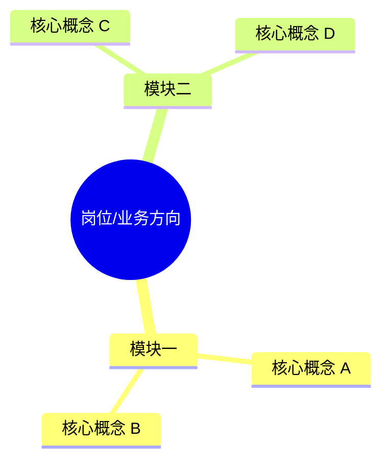

# 岗位知识体系规范

## 目录

1. 目标与边界
2. 知识地图
3. 模块正文
4. 应用场景总览
5. 补充与局部优化

## 1. 目标与边界

知识体系用于帮助用户理解岗位相关知识的概念与应用场景，不是面试题库，也不是教材目录。

- 选择与 JD 最相关的 2-4 个模块。
- 每个模块选择 2-4 个核心概念。
- 优先少而深，不堆术语。
- 总长度建议 2500-3500 字。
- 用户经历不足时写“可迁移表达”，不虚构使用经验。

## 2. 知识地图

开头输出可渲染的 Mermaid 思维导图：



如果宿主不支持 Mermaid，再紧接着提供简洁文字树；不要输出仅供特定网页解析的 `mindmap-json`。

## 3. 模块正文

```markdown
# 模块一：[知识模块名称]

[2-3 句话说明它解决什么业务问题，以及为什么当前岗位需要它。]

## 1. [核心概念]

一句话理解：

概念说明：

典型应用场景：

在这个岗位里怎么用：

常见指标或判断标准：

具体例子：

面试中可以怎么表达：
```

“具体例子”必须有业务对象、输入、判断和输出，不能只换一种说法解释概念。

## 4. 应用场景总览

末尾输出：

| 岗位任务/场景 | 需要的知识 | 具体怎么用 | 面试表达重点 |
|---|---|---|---|

## 5. 补充与局部优化

补充新模块时：

- 只输出一个新模块。
- 不重复知识地图和应用场景总览。
- 避免与已有模块重复。

局部优化模块时：

- 保持模块标题。
- 不输出知识地图。
- 不改其他模块。
- 若概念标题变化会影响知识地图，先保留原标题或提示用户后续同步更新。
